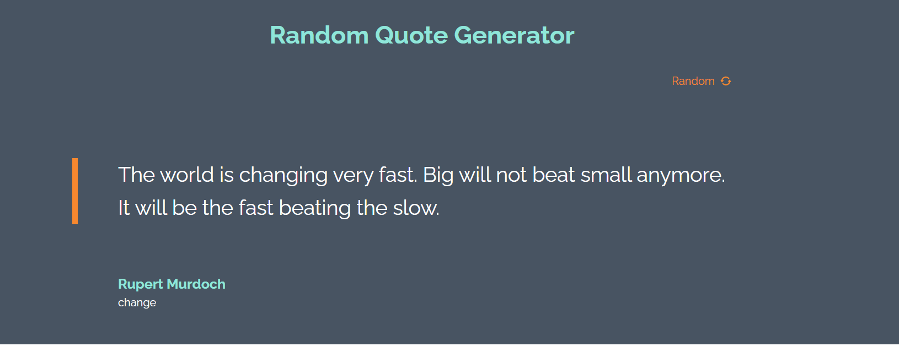

<!-- Please update value in the {}  -->

<h1 align="center">Random Quote Generator</h1>

<div align="center">
  <h3>
    <a href="https://rarchitgupta.github.io/randomquotegenerator/">
      Demo
    </a>
  </h3>
</div>

<!-- TABLE OF CONTENTS -->

## Table of Contents

- [Overview](#overview)
  - [Built With](#built-with)
- [Features](#features)
- [How to use](#how-to-use)
- [Contact](#contact)
- [Acknowledgements](#acknowledgements)

<!-- OVERVIEW -->

## Overview



A random quote generator which fetches data out of the [QuoteGarden](https://pprathameshmore.github.io/QuoteGarden/) API

### Built With

<!-- This section should list any major frameworks that you built your project using. Here are a few examples.-->

- [React](https://reactjs.org/)

## How To Use

<!-- For example: -->

To clone and run this application, you'll need [Git](https://git-scm.com) and [Node.js](https://nodejs.org/en/download/) (which comes with [npm](http://npmjs.com)) installed on your computer. From your command line:

```bash
# Clone this repository
$ git clone https://github.com/rarchitgupta/randomquotegenerator

# Install dependencies
$ npm install

# Run the app
$ npm start
```

## Contact

- GitHub [@rarchitgupta](https://{github.com/your-usermame})
- LinkedIn [Archit Gupta](https://www.linkedin.com/in/rarchit-gupta/)
